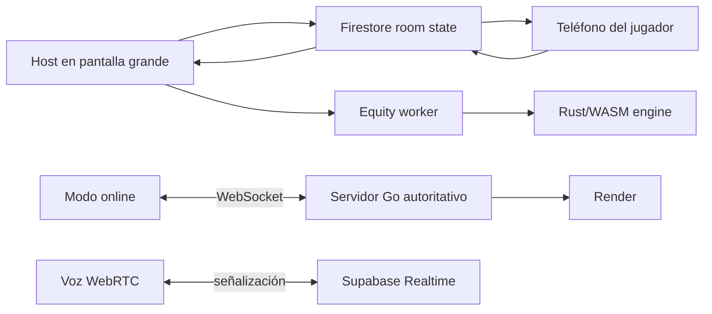

<div align="center">


# Noir Poker

Texas Hold'em multi-dispositivo para mesas presenciales, partidas online y torneos administrados.

[](https://nextjs.org/)
[](https://react.dev/)
[](https://www.typescriptlang.org/)
[](https://firebase.google.com/)
[](server/README.md)

<br />

[Stack](#stack) · [Funcionamiento](#funcionamiento) · [Desarrollo](#desarrollo-local) · [Rutas](#rutas-principales) · [Deploy](#deploy)

</div>

---


Noir Poker convierte una mesa física en una experiencia sincronizada: la pantalla principal muestra el tablero y cada jugador entra desde su teléfono para ver sus cartas privadas, actuar, hablar por voz y seguir el estado de la mano. El proyecto combina una app web en Next.js, sincronización realtime, motor de equity en WASM y un servidor Go autoritativo para el modo online.

## Stack

| Capa | Tecnología | Uso |
| --- | --- | --- |
| Web | Next.js 16 App Router, React 19, TypeScript strict | Interfaz principal, rutas de host, jugador, lobby, perfil y administración |
| UI | Tailwind CSS v4, Lucide React, GSAP, OGL | Mesa, cartas 3D, animaciones, HUDs y microinteracciones |
| Realtime | Firebase Auth anónimo, Firestore | Salas, lobby, cartas privadas, historial, economía y presencia |
| Voz | Supabase Realtime, WebRTC, TURN opcional | Señalización P2P, mute, niveles de audio y modo solo escuchar |
| Juego online | Go, WebSocket, Render | Servidor autoritativo para mazo, apuestas, side pots y showdown |
| Equity | Rust a WASM, Web Worker | Cálculo exacto y Monte Carlo sin bloquear la UI |
| CLI | TypeScript con `tsx` | Cliente de terminal para entrar a salas online |
| Calidad | ESLint 9, Vitest | Lint y pruebas unitarias de lógica core |

## Funcionamiento



### Modos de juego

| Modo | Ruta | Descripción |
| --- | --- | --- |
| Presencial | `/host` y `/play/[code]` | Mesa visual para partidas físicas. El host reparte, avanza calles y resuelve showdown; cada teléfono ve sus cartas privadas. |
| Online | `/create`, `/lobby`, `/play/normal/[code]` | Cash game con ciegas, raises, side pots, timers, chat, voz, rebuys e historial de manos. |
| Torneo | `/host/torneo` y `/admin/[code]` | Niveles de ciegas, pausa/reanudar, avance manual, knockouts y ranking final. |
| Server-backed | `/play/online/[code]` | Mesa trustless: el servidor Go reparte, valida acciones y emite estado público por WebSocket. |

### Flujo de una mano

1. El host crea una sala y comparte código, enlace o QR.
2. Los jugadores entran desde el teléfono, eligen nombre/avatar y se sientan.
3. El host inicia mano; las cartas privadas se guardan separadas del estado público.
4. La mesa avanza por preflop, flop, turn, river y showdown.
5. En Online/Torneo se procesan apuestas, side pots, all-in run-it-N, historial y stacks.
6. En Server-backed el servidor Go es la autoridad sobre mazo, acciones y resolución.

### Privacidad y seguridad de juego

- Las hole cards no se guardan en el documento público de la sala.
- El equity y los outs son host-only; no se renderizan sobre seats de jugadores.
- En modo server-backed, el mazo y las cartas ajenas nunca salen del servidor Go.
- Firebase Admin SDK respalda endpoints de economía/XP; las variables sin `NEXT_PUBLIC_` quedan solo en servidor.
- `next.config.ts` agrega cabeceras de seguridad contra framing, MIME sniffing y permisos no usados.

## Desarrollo local

### Requisitos

- Node.js 21 o superior.
- Proyecto Firebase con Firestore y Anonymous Auth.
- Go 1.23 o superior para correr `server/`.
- Rust + `wasm-pack` solo si vas a recompilar el motor de equity.

### Instalación

```bash
npm install
cp .env.example .env.local
npm run dev
```

La app queda disponible en `http://localhost:3000`.

### Variables de entorno

El archivo base es `.env.example`. Las variables `NEXT_PUBLIC_*` se incluyen en el bundle del cliente; las demás se leen solo desde servidor o procesos externos.

| Variable | Uso |
| --- | --- |
| `NEXT_PUBLIC_FIREBASE_*` | Firebase web app, Firestore y Auth anónimo |
| `FIREBASE_ADMIN_*` | Admin SDK para economía/XP en route handlers |
| `NEXT_PUBLIC_SUPABASE_URL`, `NEXT_PUBLIC_SUPABASE_ANON_KEY` | Señalización de voz por Supabase Realtime |
| `NEXT_PUBLIC_TURN_*` | TURN opcional para WebRTC en redes restrictivas |
| `NEXT_PUBLIC_GAME_WS_URL` | URL del servidor Go para modo server-backed |
| `FIREBASE_PROJECT_ID` | Servidor Go: exige idToken Firebase en handshake cuando está definido |

### Comandos

```bash
# Web Next.js
npm run dev
npm run build
npm run start

# Calidad
npm run lint
npm test
npm run test:watch

# Servidor Go autoritativo
cd server
go run ./cmd/server

# CLI de mesa online
npm run play -- MESA1 Ana

# Motor Rust/WASM
cd engine
wasm-pack build --target web --out-dir pkg
```

### Verificacion rapida

Para confirmar que el repo sigue sano tras un cambio chico:

```bash
npm run lint
npm test
cd server && go build ./cmd/server
```

### Smoke test

1. Ejecuta `npm run dev`.
2. Abre `/host` en una pestaña.
3. Abre `/play/CODIGO` en otra pestaña o teléfono.
4. Une al menos dos jugadores.
5. Reparte, avanza calles, revela cartas y confirma showdown.
6. Repite con `/create` o `/host/torneo` para validar apuestas y torneos.

## Rutas principales

| Ruta | Descripción |
| --- | --- |
| `/` | Home con accesos a modos de juego, lobby y entrada por código |
| `/create` | Creación de sala online configurable |
| `/lobby` | Salas abiertas en tiempo real |
| `/join` | Entrada por código; resuelve presencial u online |
| `/host` | Host de modo presencial |
| `/host/normal` | Host de cash game |
| `/host/torneo` | Host de torneo |
| `/play/[code]` | Vista de teléfono para presencial |
| `/play/normal/[code]` | Vista de jugador para online/torneo |
| `/play/online` | Crear o unirse a mesa server-backed |
| `/play/online/[code]` | Mesa autoritativa por WebSocket |
| `/admin/[code]` | Panel administrativo de torneo |
| `/perfil` y `/login` | Perfil, monedas, rango y login social |
| `/server-demo` | Demo técnica del servidor Go |

## Estructura

```text
poker-sim/
  src/
    app/                 Rutas Next.js App Router
    components/          UI por feature: table, betting, host, voice, online
    hooks/               Auth, salas, presencia, voz, equity, servidor online
    lib/                 Poker core, Firestore helpers, economía, evaluadores
    workers/             Equity worker
  server/                Servidor Go autoritativo por WebSocket
  engine/                Motor Rust/WASM de equity
  cli/                   Cliente de terminal para modo online
  docs/                  Planes, auditorías, voz, persistencia y seguridad
  public/                Logos, hero, favicon, assets públicos y rangos
  firestore.rules        Reglas de seguridad Firestore
  render.yaml            Blueprint de Render para el servidor Go
```

## Convenciones

- App Router vive en `src/app`; una ruta pública existe cuando hay `page.tsx` o `route.ts`.
- La UI interactiva usa `"use client"` y se organiza por feature en `src/components`.
- Imports absolutos con `@/`.
- Tailwind v4 usa tokens en `src/app/globals.css`; no hay `tailwind.config.js`.
- Los componentes no llaman `getFirestore()` directamente; usan helpers de `src/lib`.
- El estado de sala tiene una fuente de verdad por flujo.
- El copy visible de la aplicación está en español.
- Los iconos de UI salen de Lucide.

## Deploy

### Web en Vercel

1. Importa el repo en Vercel.
2. Configura `NEXT_PUBLIC_FIREBASE_*`, Supabase y `NEXT_PUBLIC_GAME_WS_URL`.
3. Ejecuta deploy. Vercel detecta Next.js automáticamente.

### Servidor Go en Render

`render.yaml` define el servicio de `server/`. En Render, crea un Blueprint desde el repo, despliega el servicio y copia la URL final a `NEXT_PUBLIC_GAME_WS_URL`.

### Reglas Firestore

```bash
firebase deploy --only firestore:rules
```

## Documentación

- [Plan de migración](docs/plan-migracion.md)
- [Roadmap y contribución](CONTRIBUTING.md)
- [Servidor Go](server/README.md)
- [CLI](cli/README.md)
- [Voz WebRTC](docs/voice-setup.md)
- [Persistencia](docs/persistence-setup.md)
- [Backlog de seguridad](docs/security-backlog.md)
- [Auditoría QA](docs/qa-audit-2026-06-03.md)

## Licencia

Sin licencia pública definida.
